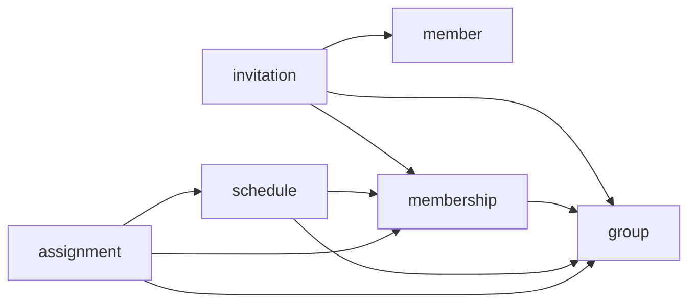

# my-app backend

아르바이트생 근무 스케줄/배정 관리 백엔드. 각 기능은 헥사고날 아키텍처(포트-어댑터)로 구성된 독립 패키지이며,
패키지 내부는 `domain` / `application(port/in, port/out, service)` / `adapter(in/web, out/persistence)` 3계층으로 반복됩니다.

```
{module}/
├── domain/            도메인 모델, 상태 전이 규칙, 도메인 예외
├── application/
│   ├── port/in/       유스케이스 인터페이스 (adapter/in이 호출)
│   ├── port/out/      리포지토리 등 외부 의존 인터페이스 (service가 호출)
│   └── service/       유스케이스 구현체 (port/out에만 의존, JPA/HTTP 타입 모름)
└── adapter/
    ├── in/web/         REST 컨트롤러 (port/in 호출)
    └── out/persistence/ JPA 구현체 (port/out 구현, JPA Entity ↔ 도메인 모델 변환)
```

## 도메인 모델 목록

| 모듈 | 도메인 모델 | 설명 |
|---|---|---|
| `member` | `Member` | 로그인 계정. `loginId`, 암호화된 `password`, `name`, `Role`(OWNER/PART_TIMER)을 가짐. 역할은 가입 시 고정되고 이후 변경되지 않음. |
| `member` | `Role` | 계정 역할 enum: `OWNER`(그룹 소유주), `PART_TIMER`(아르바이트생). |
| `group` | `WorkGroup` | OWNER가 소유하는 그룹(매장). `ownerId`로 소유자를 식별. |
| `membership` | `GroupMembership` | 초대가 수락되어 생성되는, 특정 그룹에 대한 PART_TIMER의 확정 소속 관계. `MembershipStatus`(ACTIVE/INACTIVE)를 가짐. |
| `invitation` | `Invitation` | OWNER가 PART_TIMER를 그룹에 초대하는 요청. `InvitationStatus`(PENDING→ACCEPTED/REJECTED/CANCELLED)로 상태 전이하며, 이력은 삭제되지 않고 상태만 바뀜. |
| `schedule` | `AvailabilitySlot` | PART_TIMER가 특정 그룹·날짜의 30분 슬롯에 근무 가능함을 나타냄 (row 존재 = 가능). |
| `schedule` | `RequiredStaffSlot` | OWNER가 설정한, 특정 그룹·날짜·30분 슬롯에 필요한 인원 수. |
| `assignment` | `ShiftAssignment` | OWNER가 PART_TIMER를 30분 슬롯에 배정한 확정 기록. `ShiftAssignmentStatus`(CONFIRMED/CANCELLED)를 가짐. |
| `common` | `SlotTimes` | 모든 스케줄 관련 모듈이 공유하는 30분 슬롯 규칙 유틸리티(시간 정렬 검증, 구간 → 슬롯 리스트 변환). 자체 도메인 모델은 없음. |

## 모듈별 역할

### `member` — 계정
- 회원가입(`SignUpUseCase`), 로그인 ID 중복 검사, 비밀번호 암호화(`PasswordEncryptor` 포트).
- 다른 모듈에 의존하지 않는 최하위 모듈.

### `group` — 그룹(매장)
- OWNER의 그룹 생성, 소유 그룹 목록 조회.
- `isOwnedBy(memberId)`로 소유권 검증 로직을 도메인에 캡슐화. 다른 모듈에 의존하지 않음.

### `membership` — 그룹 소속
- 초대 수락 시 생성되는 "확정된 소속" 상태를 관리. 활성 멤버 여부 조회(`existsActiveMembership`)를 다른 모듈(assignment, schedule)에 제공.
- `group`에 의존.

### `invitation` — 초대
- OWNER가 PART_TIMER를 그룹에 초대하고, 초대받은 사람이 수락/거절하거나 OWNER가 취소하는 흐름을 관리.
- 수락 시 `membership`에 `GroupMembership`을 생성하는 트리거 역할.
- `group`, `member`, `membership`에 의존.

### `schedule` — 근무 가능 시간 / 필요 인원
- PART_TIMER의 근무 가능 시간(`AvailabilitySlot`) 등록과 OWNER의 필요 인원(`RequiredStaffSlot`) 설정을 관리. `assignment`가 배정 가능 여부를 판단할 때 참조하는 기준 데이터를 제공.
- `group`, `membership`에 의존.

### `assignment` — 배정
- OWNER가 PART_TIMER를 특정 시간대에 배정. 요청 구간을 30분 슬롯 단위로 쪼개어, 슬롯마다 근무 가능 여부(`schedule`)와 필요 인원 초과 여부를 검사한 뒤 전부 통과해야만 저장(all-or-nothing).
- `group`, `membership`, `schedule`을 조합해 검증하는, 가장 많은 모듈에 의존하는 조정자(orchestrator) 역할.

### `common` — 공용
- 모든 모듈이 공유하는 슬롯 시간 규칙(`SlotTimes`), 도메인 예외 베이스(`DomainException`), 시큐리티/전역 예외 처리 등 횡단 관심사.

## 모듈 의존 관계



화살표는 "A → B: A가 B에 의존" 방향입니다.

- `member`, `group`은 다른 도메인 모듈에 의존하지 않는 기반 모듈.
- 상위 모듈은 하위 모듈의 **port/out 인터페이스와 domain 모델만** 참조하고, 하위 모듈의 adapter는 참조하지 않음.
